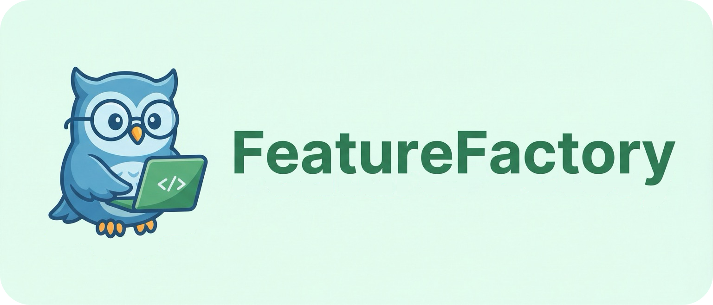

<p align="center">
  
</p>

<p align="center">
  <a href="#quick-start"></a>
  <a href="#quick-start"></a>
  <a href="#quick-start"></a>
  <a href="docs/blueprint.md"></a>
</p>

---

FeatureFactory is an agent-driven data production pipeline for scalable, end-to-end generation of feature-level coding data. It automatically produces long-horizon, multi-language datasets.

## 🚀 Quick Start

**Prerequisites:**

- [uv](https://docs.astral.sh/uv/)
- [Docker](https://www.docker.com/)

```bash
git clone --recurse-submodules https://github.com/potatoQi/FeatureFactory.git
cd FeatureFactory
git submodule update --init --recursive

uv sync --extra dev
cp .env.example .env

uv run uvicorn feature_factory.server:create_app --factory --host 127.0.0.1 --port 18741
```

To inspect an existing FeatureFactory database without recovering tasks,
cleaning runtime assets, scheduling batch work, or allowing API mutations, run
the server in observer mode:

```bash
FEATURE_FACTORY_SERVER_OBSERVER_MODE=1 \
uv run uvicorn feature_factory.server:create_app --factory --host 127.0.0.1 --port 18742
```
